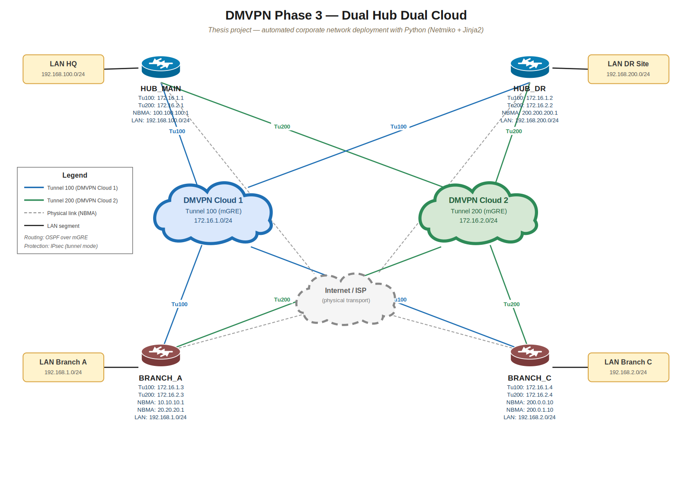
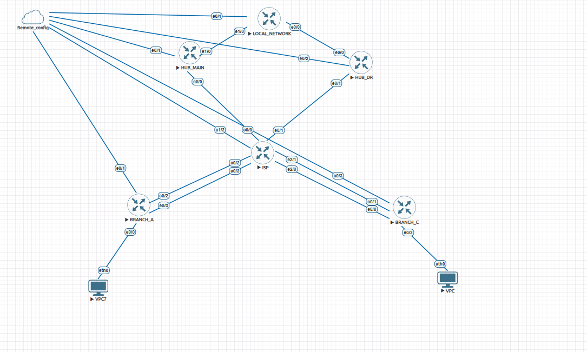

# DMVPN Automation — Dual Hub, Dual Cloud (Phase 3)

Python automation for deploying Cisco Dynamic Multipoint VPN in a dual-hub,
dual-cloud Phase 3 topology. Configuration is generated from Jinja2 templates
driven by a single YAML inventory and pushed over SSH via Netmiko.

Built as a network automation learning project (BSc thesis, KSTU).

## Topology

- **2 hubs**: `HUB_MAIN`, `HUB_DR`
- **2 spokes**: `BRANCH_A`, `BRANCH_C` — each dual-homed across two ISPs
  (VRFs `INET1` / `INET2`)
- **2 DMVPN clouds**: tunnel 100 and tunnel 200 — each spoke keeps an
  independent NHRP/IPsec relationship to each hub, over each ISP path
- GRE multipoint tunnels protected by IPsec, OSPF running point-to-multipoint
  over each cloud
- No NAT

Redundancy exists at both the hub level and the transport level: losing one
ISP or one hub doesn't take down the overlay.



*Editable sources: [`topology.drawio`](img/topology.drawio) (open in [diagrams.net](https://app.diagrams.net)) and [`topology.svg`](img/topology.svg).*

## EVE-NG lab



## Features

- Config generation via Jinja2 (`hub.j2`, `spoke.j2`) driven entirely by
  `information.yaml` — no manual per-device CLI typing
- Hub NBMA/tunnel-IP database is built dynamically from the hub inventory,
  then injected into spoke templates so each spoke's NHS mapping stays in
  sync with the hub config
- Zone-based firewall generated per spoke (LAN/WAN/tunnel zones, policy-maps
  for DMVPN, OSPF, ICMP, traceroute traffic)
- Post-deploy health verification: IKEv2 SA state, IPsec SA counters
  (flags tunnels stuck `ACTIVE` with zero tx/rx), NHRP peer registration
  count, OSPF neighbor `FULL` count
- Credentials (SSH + enable) are prompted interactively at runtime, never
  hardcoded

## Repository structure

| File | Purpose |
|---|---|
| `automation.py` | Builds the hub NBMA database, renders + pushes configs, runs health verification |
| `hub.j2` | Jinja2 template for hub routers |
| `spoke.j2` | Jinja2 template for spoke routers (includes zone-based firewall) |
| `information.yaml` | Inventory: global vars + per-device roles, interfaces, tunnels |

## Tech stack

Python 3 · Netmiko · Jinja2 · PyYAML · Cisco IOS · EVE-NG

## Prerequisites

- Python 3.x
- `jinja2`, `netmiko`, `pyyaml`
- Cisco IOS lab (tested in EVE-NG), reachable management IPs

## Setup

```bash
git clone https://github.com/taiyrbek/dmvpn-automation.git
cd dmvpn-automation
python -m venv venv
source venv/bin/activate   # Windows: venv\Scripts\activate
pip install jinja2 netmiko pyyaml
```

## Inventory format

`information.yaml` has two top-level keys: `global` (shared OSPF
process/area, IKEv2 PSK, tunnel key) and `routers` (list of devices).
Trimmed example — one hub, one spoke:

```yaml
global:
  ospf_proc: 100
  ospf_area: 0
  ikev2_key: Cisco123   # lab-only — see Disclaimer
  tunnel_key: 12345

routers:
  - hostname: HUB_MAIN
    role: hub
    ip_management: 192.168.50.135
    tunnels:
      - id: 100
        ip: 172.16.1.1
        tunnel_source: Ethernet0/0
        nhrp_network_id: 100
      - id: 200
        ip: 172.16.2.1
        tunnel_source: Ethernet0/0
        nhrp_network_id: 200
    interface:
      - name: Ethernet0/0
        ip: 100.100.100.1
        gateway_ip: 100.100.100.2

  - hostname: BRANCH_A
    role: spoke
    ip_management: 192.168.50.139
    tunnels:
      - id: 100
        ip: 172.16.1.3
        tunnel_source: Ethernet0/2
        nhrp_network_id: 100
        tunnel_vrf: INET1
    interface:
      - name: Ethernet0/2
        ip: 10.10.10.1
        vrf: INET1
```

The full working inventory for the 4-device lab (2 hubs, 2 dual-homed
spokes) is in `information.yaml`.

## Usage

```bash
python automation.py
```

1. Prompts for SSH username, password, enable secret
2. Reads `information.yaml`, builds a tunnel-IP → NBMA-IP database from
   hub entries
3. Renders and pushes `hub.j2` to hubs, `spoke.j2` (with the hub DB
   injected) to spokes
4. Waits 40s for DMVPN/OSPF convergence
5. Reconnects to every device and prints a health report (IKEv2, IPsec,
   NHRP, OSPF)

## Design decisions

**Hub database is built before any spoke is touched.** `automation.py`
does a full pass over the inventory to collect every hub's
`{tunnel_ip, nbma_ip, nhrp_id}` before rendering or pushing a single spoke
config. Spoke templates need each hub's tunnel IP and real (NBMA) IP to
write `ip nhrp nhs ... nbma ...` statements — that data only exists once
every hub tunnel has been indexed, so hub discovery has to happen first,
structurally, not just chronologically.

**Every spoke gets the full hub list; the template filters by
NHRP network-id.** Instead of pre-filtering the hub database per spoke in
Python, the raw list is handed to every spoke template, and `spoke.j2`
picks the right hub(s) itself with ``.
Keeps the Python side dumb and puts DMVPN-specific matching logic in one
place — the template — instead of splitting it across script and template.

**Two independent DMVPN clouds instead of one dual-homed cloud.**
Tunnel 100 and Tunnel 200 are separate NHRP domains, each with its own
network-id and its own IPsec/OSPF state, rather than a single cloud with
two NHS entries per hub. A problem in one cloud (bad crypto negotiation,
one ISP down) doesn't affect the other cloud's state machine.

## Known limitations

- **Not idempotent** — the script always renders and pushes the full
  config; it doesn't diff against current device state first. Fine for
  initial lab bring-up, not safe to blindly re-run against a live network.
- **Crypto suite is lab-grade, not production**: AES-128-CBC + MD5 +
  DH group 14. Acceptable in a controlled lab, wouldn't survive a real
  security review.
- **No rollback / dry-run** — a failed push on one device is caught and
  logged, the script moves on to the next device; nothing reverts
  automatically.
- **Fixed 40s convergence wait** instead of actual state polling — works
  for a small 4-device lab, doesn't scale.
- **Health check is string-matching**, not structured parsing (no
  TextFSM) — good enough for a quick human-readable report, not for
  comparing against intended state.

## Disclaimer

This is a lab project (EVE-NG). `ikev2_key` and `tunnel_key` in
`information.yaml` are dummy lab values, not production secrets — don't
reuse them anywhere real.

## Roadmap

- YAML-vs-live state reconciliation (compare expected spoke registrations
  against `show dmvpn` output on the hub)
- Idempotent config push (diff before apply)
- Separate read path (monitoring/reconciliation) from write path
  (config deploy via CI/CD) instead of direct SSH push from a script

## Author

BSc thesis project, KSTU. Built while learning Python network automation —
feedback and issues welcome.
